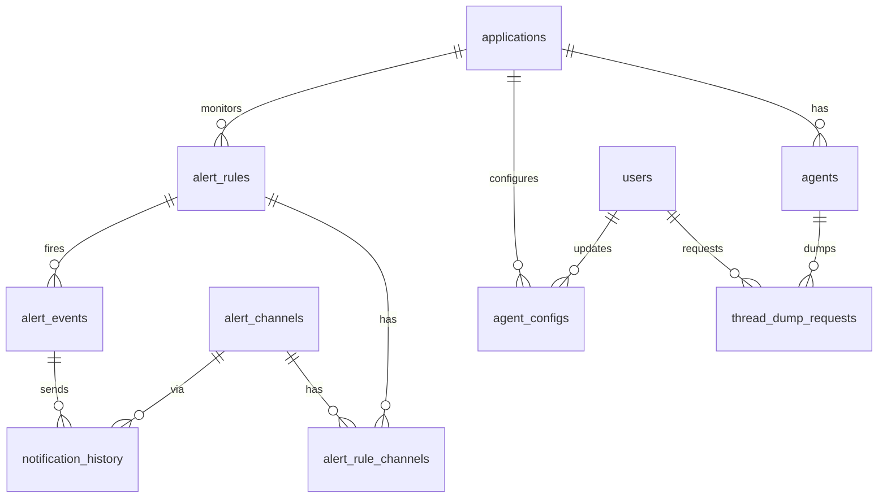

> STATUS: TENTATIVE (blocked by Q14 · 2단계 규모 숫자 미확정) — 3단계 `30-architecture.md`의 "소유 데이터" 절에 편입될 초안. ORDER BY·파티션·TTL 값은 `20-scope.md` 숫자가 나오면 재검증한다.
> 근거 ADR: `#15` `#20` `#22` `#27` `#30` `#31` `#32` · 보관기간·처리량은 `10-requirements.md` §3 · PG 영역 정본은 `erd-pg-input-sheet.md`(agent_key·application_configs 1:1·UUID 규칙), 팀 공유 최종본은 Notion ERD 페이지(2026-09-12). Redis 명령 채널 언급은 `#31`로 폐기됨(HTTP 팬아웃)

# ClickHouse 기반 ERD 설계 가이드

## 1. ClickHouse는 무엇이 다른가 (RDBMS와 비교)

### 1-1. 한 줄 비유
- **RDBMS(PostgreSQL)** = 고객 카드 서랍. 카드 한 장(행)을 꺼내 고치고 다시 넣는다. 카드끼리 번호로 연결(FK)한다.
- **ClickHouse** = 회계 장부의 **열(컬럼) 단위 두루마리**. "이번 달 매출 합계"처럼 한 열을 통째로 읽어 더하는 데 최적화. 한 줄을 고치는 일은 거의 안 한다.

### 1-2. 차이표

| 관점 | PostgreSQL | ClickHouse | ERD에 미치는 영향 |
|---|---|---|---|
| 저장 방식 | 행(row) 단위 | **열(column) 단위** + 압축 | 컬럼 수가 많아도 부담 없음. 읽는 컬럼만 디스크에서 읽음 |
| 기본 키 | 유일성 보장 인덱스(B-tree) | **ORDER BY = 정렬 키**. 유일성 보장 없음. 8,192행마다 1개 표시만 두는 희소 인덱스 | ERD의 "PK"는 **정렬 순서 선언**이다. 앞쪽 컬럼일수록 자주 `WHERE`에 쓰이고 카디널리티 낮아야 한다 |
| 외래 키 | 선언·강제 가능 | **없음** (선언 자체 불가) | 관계선은 "논리 참조"일 뿐. 점선으로 그린다 |
| 정규화 | 3NF, JOIN으로 조립 | **비정규화 기본**. JOIN은 오른쪽 테이블을 메모리에 다 올림 | `service_name`을 모든 행에 그냥 복사한다. `LowCardinality`가 사전 압축해 줌 |
| UPDATE/DELETE | 행 단위, 가벼움 | **뮤테이션** = 파트 통째 재작성. 느리고 비동기 | 수정 잦은 데이터(규칙·설정)는 CH에 두지 않는다 (`#20`) |
| 트랜잭션 | ACID | 사실상 없음 (배치 INSERT 단위 원자성만) | 상태 데이터는 PG |
| INSERT | 단건 OK | **단건 취약**. 최소 1,000행씩 묶어 넣어야 함 (`#15` 전제조건) | 적재 처리기가 배칭 소유 |
| 삭제 정책 | 앱이 DELETE | **TTL** 선언으로 자동 삭제 | 보관기간(15일/90일/1년, 로그 7일, 트레이스 3일)이 테이블 DDL에 들어간다 |
| 집계 | 쿼리 시 계산 | **Materialized View + AggregatingMergeTree**로 INSERT 시점에 미리 집계 | ERD에 "원본 → 집계" 화살표(MV)가 등장한다. RDBMS ERD에는 없는 요소 |
| 파티션 | 옵션(선언적 파티셔닝) | **PARTITION BY** 필수급. 보통 날짜 단위. TTL·삭제·쿼리 프루닝 단위 | 테이블 헤더에 파티션 키 표기 |
| NULL | 자유 | `Nullable`은 별도 마스크 파일 → 느림 | 기본값('' 또는 0)으로 대체. ERD에 NOT NULL 표시 안 해도 됨 |

### 1-3. 핵심 개념 4개 (이것만 알면 ERD 그릴 수 있다)

1. **MergeTree 계열 엔진** — 파트(파일 묶음)로 INSERT되고 백그라운드에서 병합된다. 변형이 있다.
   - `MergeTree`: 원본 저장. 그대로 쌓는다.
   - `SummingMergeTree`: 같은 정렬 키 행을 병합할 때 숫자 컬럼을 **합산**. 카운트 집계용.
   - `AggregatingMergeTree`: `avgState`·`quantileState` 같은 **중간 상태**를 저장해 나중에 병합. 평균·백분위 집계용.
   - `ReplacingMergeTree`: 같은 키의 최신 행만 남김. "마지막 상태" 저장용. (우리는 PG가 있어 잘 안 씀)
2. **ORDER BY(정렬 키)** — 도서관 서가 정렬 순서. `(service_name, span_name, time)`이면 "이 서비스의 이 URL을 이 시간대에" 조회가 디스크 몇 블록만 읽는다. 반대로 `trace_id`처럼 무작위 값을 맨 앞에 두면 압축률·조회 모두 망한다.
3. **Materialized View(MV)** — 원본 테이블에 INSERT가 들어올 때마다 **자동으로 실행되는 INSERT 트리거**. 결과를 다른 테이블(`TO target`)에 쓴다. 과거 데이터는 안 채워주므로 처음부터 만들어 둔다. MV 대상 테이블에 다시 MV를 걸 수 있다(체인).
4. **스킵 인덱스(데이터 스키핑 인덱스)** — 정렬 키에 없는 컬럼으로 찾을 때 "이 블록엔 없다"를 빨리 판정하는 보조 인덱스. `bloom_filter`(trace_id 조회), `tokenbf_v1`(로그 본문 단어 검색), `minmax`(duration 범위).

### 1-4. 자주 하는 실수
- 파티션을 시간 단위로 잘게 쪼갠다 → 파트 폭증. **일 단위**로 시작한다.
- ORDER BY 첫 컬럼에 고카디널리티(trace_id, span_id)를 둔다.
- `Nullable(String)`을 습관적으로 쓴다.
- 서비스명을 정수 ID로 정규화하고 JOIN한다 → 그냥 문자열 `LowCardinality(String)`로 넣는다.
- `SELECT *` 로 Map·Nested 컬럼까지 읽는다.
- 단건 INSERT → `too many parts` 예외.

## 2. 우리 프로젝트 ERD의 기본 구조 — 두 영역, 한 장

```
┌───────────── PostgreSQL 영역 (상태) ─────────────┐   ┌──────────── ClickHouse 영역 (신호) ────────────┐
│ 전통 ERD. 실선 FK, 까마귀발, 3NF                    │   │ 테이블 = 이벤트 스트림. FK 없음.                  │
│ applications ─< agents ─< agent_configs            │   │ 원본(MergeTree) ══MV══> 집계(Summing/Aggregating) │
│ alert_rules >─< alert_channels                     │   │ 각 상자 헤더: ENGINE / ORDER BY / PARTITION / TTL │
│ alert_rules ─< alert_events ─< notification_history│   │ 관계선은 점선(논리 참조)만                        │
└─────────────────────────────────────────────────────┘   └───────────────────────────────────────────────────┘
          service_name / agent_id 문자열이 두 영역을 잇는 "논리 키" (점선, FK 아님)
```

**원칙**
1. **수정·삭제가 생기는 것 = PG, 한 번 쓰고 안 고치는 것 = CH.** 이 한 줄로 어느 영역인지 판정한다.
2. CH 영역은 **화면(질의 패턴)에서 역산**한다. Pinpoint 화면 1개 ≈ 집계 테이블 1개. Cassandra처럼 화면마다 원본을 다시 설계하는 게 아니라, **원본 3~4개는 고정하고 집계 테이블만 MV로 늘린다** (`#27` 기각 사유의 역).
3. 두 영역 사이 JOIN 금지. 질의 파사드가 CH 결과에 PG 메타데이터(표시 이름 등)를 애플리케이션에서 붙인다.
4. 롤업(집계)은 CH 안 (`#22`). PG에는 집계 결과를 두지 않는다.

## 3. ClickHouse 영역 — 테이블 목록 (Pinpoint 화면 매핑)

### 3-1. 원본 테이블 (MergeTree, 적재 처리기가 배치 INSERT)

| 테이블 | 담는 것 | Pinpoint 대응 | ORDER BY (초안) | PARTITION | TTL |
|---|---|---|---|---|---|
| `spans` | 모든 스팬 (OTLP 트레이스 1 span = 1 행) | `TraceV2` | `(service_name, span_name, toDateTime(start_time))` | `toDate(start_time)` | 3일 |
| `metrics_raw` | 에이전트 시스템 메트릭 (CPU·힙·GC·스레드 수), 15초 간격, **long 형식**(1 지표 = 1 행) | `AgentStatV2` | `(service_name, agent_id, metric_name, series_hash, ts)` | `toYYYYMMDD(ts)` | 15일 |
| `logs` | Logback 로그 라인 (trace_id 붙음) | (Pinpoint 없음) | `(service_name, toDateTime(ts))` | `toDate(ts)` | 7일 |
| `thread_dumps` | 명령 채널로 요청한 스레드 덤프 결과 (**Q16** — 영속화 여부 미정) | Active Thread Dump | `(agent_id, requested_at)` | `toDate(requested_at)` | 3일 |

**`spans`의 설계 포인트 3개**
- `parent_service_name` 컬럼을 둔다. 에이전트가 전파 헤더(Pinpoint의 `Pinpoint-pAppName`에 해당)로 받아 채운다. → **서버맵 간선을 부모 스팬과 JOIN 없이** SERVER 스팬 한 행에서 뽑는다. 이게 없으면 서버맵이 CH에서 가장 비싼 self-join이 된다.
- `trace_id`로 콜트리를 여는 조회는 정렬 키 밖이므로 `bloom_filter` 스킵 인덱스를 건다 (`#27` 되돌림 조건 "트레이스 단건 p95 3초"의 1차 튠 수단).
- 예외·이벤트는 `events Nested(...)`로 같은 행에 넣는다. 별도 테이블로 빼면 JOIN이 생긴다.

**`metrics_raw`를 wide(에이전트 1행에 컬럼 100개)가 아니라 long(1 지표 1행)으로 하는 이유 (Q17 잠정)**
- OTLP 메트릭 모델이 long이다. 변환 없이 적재.
- 지표를 추가할 때 스키마 변경(ALTER)이 없다.
- 1분/1시간 롤업 MV가 지표 종류와 무관하게 하나로 끝난다.
- 반대 근거(wide가 나은 경우): 인스펙터 화면이 한 에이전트의 지표 100개를 한 번에 그리므로 wide면 1행 읽기로 끝난다. 우리 규모(에이전트 수십 대)에서는 long으로도 충분하다고 잠정 판단. **2단계 카디널리티 숫자로 검증.**

### 3-2. 집계 테이블 (MV가 자동 생성, 화면 1개 = 테이블 1개)

| 테이블 | 화면 | 원본 | 엔진 | 키 (초안) | TTL |
|---|---|---|---|---|---|
| `transactions` | 스캐터 차트(점 하나 = 트랜잭션), 드래그 → 목록 | `spans` WHERE 루트 스팬 | MergeTree | `(service_name, start_time)` | 3일 |
| `heatmap_1m` | 히트맵(긴 기간) | `transactions` (MV 체인) | SummingMergeTree | `(service_name, ts_min, latency_bucket, is_error)` → `cnt` | 90일 |
| `url_stats_1m` | URL 통계(호출수·에러수·p50/p95/p99) | `spans` WHERE SERVER | AggregatingMergeTree | `(service_name, ts_min, span_name, agent_id)` | 90일 |
| `server_map_1m` | 서버맵 간선(호출수·에러·평균지연) | `spans` — SERVER 스팬(부모서비스→나) + CLIENT 스팬(나→DB/외부HTTP) | SummingMergeTree | `(ts_min, caller_service, callee_service, callee_kind)` | 90일 |
| `metrics_1m` | 인스펙터 15일 이상 구간, 경보 평가 | `metrics_raw` | AggregatingMergeTree | `(service_name, agent_id, metric_name, series_hash, ts_min)` | 90일 |
| `metrics_1h` | 1년 추세 | `metrics_1m` (MV 체인) | AggregatingMergeTree | 같음, `ts_hour` | 1년 |
| `service_health_1m` | 경보 탐지기가 주기 조회하는 5xx 비율·p95 (`#30`: 탐지기는 CH 조회) | `spans` WHERE SERVER | AggregatingMergeTree | `(service_name, ts_min)` | 30일 |

서버맵 간선 이중 집계 방지: **서비스→서비스 간선은 SERVER 스팬(수신 측)에서만** 세고, CLIENT 스팬은 `db.system` 또는 외부 호스트처럼 **우리 에이전트가 없는 대상**으로 가는 것만 센다.

### 3-3. DDL 초안 (검증 전, 문법 참고용)

```sql
-- 원본: 스팬
CREATE TABLE spans (
  start_time          DateTime64(9) CODEC(Delta, ZSTD(1)),
  service_name        LowCardinality(String),
  agent_id            LowCardinality(String),
  trace_id            String,
  span_id             String,
  parent_span_id      String,                      -- '' 이면 루트 스팬
  parent_service_name LowCardinality(String),      -- 에이전트가 전파 헤더에서 채움 ('' = 외부 진입)
  span_kind           Enum8('INTERNAL'=0,'SERVER'=1,'CLIENT'=2,'PRODUCER'=3,'CONSUMER'=4),
  span_name           LowCardinality(String),      -- 'GET /api/orders/{id}'
  duration_ns         UInt64,
  status_code         Enum8('UNSET'=0,'OK'=1,'ERROR'=2),
  http_status         UInt16 DEFAULT 0,
  peer_address        String DEFAULT '',            -- CLIENT 스팬의 대상 (DB 호스트 등)
  attributes          Map(LowCardinality(String), String),
  events              Nested(ts DateTime64(9), name LowCardinality(String),
                              attributes Map(LowCardinality(String), String)),
  INDEX idx_trace_id  trace_id    TYPE bloom_filter(0.001) GRANULARITY 1,
  INDEX idx_duration  duration_ns TYPE minmax GRANULARITY 1
) ENGINE = MergeTree
PARTITION BY toDate(start_time)
ORDER BY (service_name, span_name, toDateTime(start_time))
TTL toDateTime(start_time) + INTERVAL 3 DAY
SETTINGS ttl_only_drop_parts = 1;

-- 집계: 루트 스팬만 → 스캐터
CREATE TABLE transactions (
  start_time   DateTime64(3), service_name LowCardinality(String), agent_id LowCardinality(String),
  trace_id String, span_name LowCardinality(String), duration_ms UInt32, is_error UInt8, http_status UInt16
) ENGINE = MergeTree PARTITION BY toDate(start_time)
ORDER BY (service_name, start_time) TTL toDateTime(start_time) + INTERVAL 3 DAY;

CREATE MATERIALIZED VIEW mv_transactions TO transactions AS
SELECT start_time, service_name, agent_id, trace_id, span_name,
       toUInt32(duration_ns / 1000000) AS duration_ms,
       status_code = 'ERROR' AS is_error, http_status
FROM spans WHERE parent_span_id = '';

-- 집계: 히트맵 (MV 체인: transactions → heatmap_1m)
CREATE TABLE heatmap_1m (
  ts_min DateTime, service_name LowCardinality(String), latency_bucket UInt16, is_error UInt8, cnt UInt64
) ENGINE = SummingMergeTree PARTITION BY toYYYYMM(ts_min)
ORDER BY (service_name, ts_min, latency_bucket, is_error) TTL ts_min + INTERVAL 90 DAY;

CREATE MATERIALIZED VIEW mv_heatmap_1m TO heatmap_1m AS
SELECT toStartOfMinute(start_time) AS ts_min, service_name,
       toUInt16(least(intDiv(duration_ms, 50), 200)) AS latency_bucket,   -- 50ms 폭, 상한 10초
       is_error, count() AS cnt
FROM transactions GROUP BY ts_min, service_name, latency_bucket, is_error;

-- 집계: URL 통계 (백분위는 상태로 저장)
CREATE TABLE url_stats_1m (
  ts_min DateTime, service_name LowCardinality(String), span_name LowCardinality(String), agent_id LowCardinality(String),
  cnt AggregateFunction(count), err_cnt AggregateFunction(sum, UInt8),
  dur_q AggregateFunction(quantilesTDigest(0.5, 0.95, 0.99), UInt64)
) ENGINE = AggregatingMergeTree PARTITION BY toYYYYMM(ts_min)
ORDER BY (service_name, ts_min, span_name, agent_id) TTL ts_min + INTERVAL 90 DAY;

CREATE MATERIALIZED VIEW mv_url_stats_1m TO url_stats_1m AS
SELECT toStartOfMinute(start_time) AS ts_min, service_name, span_name, agent_id,
       countState() AS cnt, sumState(toUInt8(status_code = 'ERROR')) AS err_cnt,
       quantilesTDigestState(0.5, 0.95, 0.99)(duration_ns) AS dur_q
FROM spans WHERE span_kind = 'SERVER'
GROUP BY ts_min, service_name, span_name, agent_id;
-- 조회: SELECT ..., countMerge(cnt), quantilesTDigestMerge(0.5,0.95,0.99)(dur_q) ... GROUP BY ...

-- 원본: 메트릭 (long 형식)
CREATE TABLE metrics_raw (
  ts           DateTime CODEC(DoubleDelta, ZSTD(1)),
  service_name LowCardinality(String),
  agent_id     LowCardinality(String),
  metric_name  LowCardinality(String),               -- 'jvm.memory.heap.used'
  series_hash  UInt64,                                -- cityHash64(attributes 직렬화). Map은 정렬 키에 못 들어가므로
  attributes   Map(LowCardinality(String), String),   -- {'gc':'G1 Old Generation'} 등
  value        Float64 CODEC(Gorilla, ZSTD(1))
) ENGINE = MergeTree PARTITION BY toYYYYMMDD(ts)
ORDER BY (service_name, agent_id, metric_name, series_hash, ts)
TTL ts + INTERVAL 15 DAY;

-- 원본: 로그
CREATE TABLE logs (
  ts DateTime64(3), service_name LowCardinality(String), agent_id LowCardinality(String),
  trace_id String DEFAULT '', span_id String DEFAULT '',
  level LowCardinality(String), logger LowCardinality(String), thread String,
  message String CODEC(ZSTD(3)),
  attributes Map(LowCardinality(String), String),
  INDEX idx_trace trace_id TYPE bloom_filter(0.001) GRANULARITY 1
  -- INDEX idx_msg message TYPE tokenbf_v1(32768, 3, 0) GRANULARITY 1  ← `#15` 되돌림 조건(LIKE p95 > 3초) 발동 시 추가
) ENGINE = MergeTree PARTITION BY toDate(ts)
ORDER BY (service_name, toDateTime(ts)) TTL toDateTime(ts) + INTERVAL 7 DAY;
```

## 4. PostgreSQL 영역 — 상태·관계 데이터 (전통 ERD)

| 테이블 | 역할 | 주요 컬럼 | 관계 |
|---|---|---|---|
| `applications` | 감시 대상 서비스(=`service_name`) | id, name(UNIQUE), display_name, created_at | 1 ─< agents, alert_rules, agent_configs |
| `agents` | 에이전트 인스턴스 등록·생존 | id, agent_id(UNIQUE), application_id FK, hostname, ip, jvm_version, agent_version, first_seen_at, last_seen_at, status | 수집기가 하트비트마다 `last_seen_at` 갱신 (PG면 가벼움) |
| `agent_configs` | 핵심기능 5 — 재배포 없는 설정 | id, application_id FK, agent_id NULL(전체/개별), sampling_rate, log_level, version, updated_by, updated_at | 변경 시 Redis 채널로 푸시 (`#29`) |
| `alert_rules` | 핵심기능 2 — 경보 규칙 | id, application_id FK, metric_kind(5xx_rate/p95/cpu/heap…), operator, threshold, window_sec, severity, enabled | >─< alert_channels |
| `alert_channels` | 알림 채널 | id, type(email/sms/webhook/pagerduty), config(jsonb), enabled | |
| `alert_rule_channels` | M:N | rule_id FK, channel_id FK | |
| `alert_events` | 발화/해소 인시던트 | id, rule_id FK, fired_at, resolved_at NULL, observed_value, state(FIRING/RESOLVED), fingerprint(중복 억제) | 1 ─< notification_history |
| `notification_history` | 채널 전송 이력 | id, alert_event_id FK, channel_id FK, sent_at, result(SUCCESS/FAIL), response | |
| `thread_dump_requests` | 덤프 요청 상태(요청→완료) | id, agent_id FK, requested_by, requested_at, completed_at, status | 결과 본문은 CH `thread_dumps` 또는 여기 text (**Q16**) |
| `users` (선택) | 로그인 최소치. RBAC 세분화는 비목표 | id, email, password_hash, role | |

**메모** — `agents.last_seen_at`는 초당 수십 건 UPDATE지만 에이전트 수십 대 규모에서 PG에 무해하다. 이것을 CH에 두면 뮤테이션 지옥이 된다(`#20` 근거의 살아 있는 예).

### Mermaid 초안 (PG 영역)

PG 테이블은 **10개**다(표와 동일). `alert_rule_channels`는 M:N 연결 테이블이라 별도 상자로 그린다.



**FK 컬럼 타입 주의** — `agents.application_id` 같은 FK는 `BIGINT`(참조)이지 `BIGSERIAL`(자동 증가)이 아니다. `BIGSERIAL`은 각 테이블의 자기 `id` 한 곳에만 쓴다. PG 영역의 관계선은 점선이 아니라 **실선**(진짜 FK)이다.

## 5. ERD 그리는 법 (도구 무관 규칙)

1. **한 장에 두 영역**을 좌우로 나눈다. 배경색을 달리 한다.
2. **PG 상자**: 일반 ERD 표기(PK·FK·까마귀발).
3. **CH 상자**: 헤더에 4줄 고정 — `ENGINE` / `ORDER BY` / `PARTITION BY` / `TTL`. 컬럼 목록에서 정렬 키 컬럼에 🔑 표시(PK 대신). 스킵 인덱스는 컬럼 옆 `[bf]`·`[tokenbf]` 태그.
4. **CH 화살표 종류는 둘**: 굵은 실선 화살표 = MV(원본→집계, "자동 파생"), 점선 = 논리 참조(`trace_id`, `service_name`). FK 실선은 CH 영역에 절대 그리지 않는다.
5. **영역 사이 선**: `applications.name ⇢ *.service_name`, `agents.agent_id ⇢ *.agent_id` 점선 2개만.
6. 각 CH 테이블 상자에 **"어느 화면이 읽는가"** 를 꼬리표로 붙인다(스캐터·히트맵·URL통계·서버맵·인스펙터·경보). 화면 없는 테이블은 만들지 않는다.
7. 도구: dbdiagram.io(DBML `Note` 로 헤더 4줄), 또는 기존 Figma 파일 `1dH26CE91tZIpMiW1mbC8t` 에 새 페이지. Mermaid `erDiagram`은 CH 헤더 표기가 안 되어 PG 영역만 적합.

## 5-1. 예시 — `spans` 상자 하나를 그려 보면

PG 상자와 달리 **헤더 4줄이 곧 설계**다. 컬럼 목록에서 🔑는 ORDER BY 순서(1·2·3·4)를 뜻하고 PK가 아니다.

```
┌─ 콜트리 · 스캐터 원본 · 서버맵 원본 ──────────────── spans ─┐   ← 꼬리표: 읽는 화면
│ ENGINE       MergeTree                                        │
│ ORDER BY     (service_name, span_name, toDateTime(start_time))
│ PARTITION BY toDate(start_time)                               │
│ TTL          3일 (ttl_only_drop_parts)                        │
├───────────────────────────────────────────────────────────────┤
│ 🔑3  start_time           DateTime64(9)                       │
│ 🔑1  service_name         LowCardinality(String)   ⇢ applications.name
│      agent_id             LowCardinality(String)   ⇢ agents.agent_id
│ 🔑4  trace_id             String              [bf] │   ← 스킵 인덱스 태그
│      span_id              String                    │
│      parent_span_id       String                    │   '' = 루트 스팬
│      parent_service_name  LowCardinality(String)    │   에이전트가 전파 헤더로 채움
│      span_kind            Enum8(SERVER/CLIENT/…)    │
│ 🔑2  span_name            LowCardinality(String)    │   'GET /api/orders/{id}'
│      duration_ns          UInt64            [minmax]│
│      status_code          Enum8(UNSET/OK/ERROR)     │
│      http_status          UInt16                    │
│      peer_address         String                    │   CLIENT 스팬의 대상
│      attributes           Map(String,String)        │
│      events               Nested(ts,name,attributes)│   예외·이벤트 내장 (별도 테이블 아님)
└───────────────────────────────────────────────────────────────┘
        ║ MV mv_transactions   (WHERE parent_span_id = '')
        ╠══════════════════════▶ transactions
        ║ MV mv_url_stats_1m   (WHERE span_kind = 'SERVER')
        ╠══════════════════════▶ url_stats_1m
        ║ MV mv_server_map_1m  (SERVER + CLIENT 분기)
        ╠══════════════════════▶ server_map_1m
        ║ MV mv_service_health_1m
        ╚══════════════════════▶ service_health_1m
```

선 규칙 복습 — `║═▶` 굵은 실선 = MV 파생(원본이 바뀌면 자동으로 같이 바뀜), `⇢` 점선 = PG 영역으로 가는 논리 참조(FK 아님), `trace_id`·`span_id`·`parent_span_id`는 **자기 자신을 가리키는 논리 참조**라 선을 그리지 않고 컬럼 설명으로만 적는다.

### dbdiagram.io(DBML)로 옮기면

DBML에는 ClickHouse 타입·ORDER BY 개념이 없으므로 **헤더 4줄은 `Note`에, 정렬 키 순서는 컬럼 note에** 적는다. `Ref`는 점선 논리 참조 용도로만 쓰고, MV 화살표는 집계 테이블 쪽 `Note`에 "source: spans (MV mv_…)"로 적는다.

```dbml
Table spans [headercolor: #2f6f9f] {
  start_time          "DateTime64(9)"          [note: 'ORDER BY 3']
  service_name        "LowCardinality(String)" [note: 'ORDER BY 1 · ⇢ applications.name']
  agent_id            "LowCardinality(String)" [note: '⇢ agents.agent_id']
  trace_id            String                   [note: 'ORDER BY 4 · INDEX bloom_filter']
  span_id             String
  parent_span_id      String                   [note: "'' = 루트 스팬"]
  parent_service_name "LowCardinality(String)" [note: '에이전트 전파 헤더 → 서버맵 JOIN 제거']
  span_kind           Enum8                    [note: 'INTERNAL/SERVER/CLIENT/PRODUCER/CONSUMER']
  span_name           "LowCardinality(String)" [note: 'ORDER BY 2 · GET /api/orders/{id}']
  duration_ns         UInt64                   [note: 'INDEX minmax']
  status_code         Enum8                    [note: 'UNSET/OK/ERROR']
  http_status         UInt16
  peer_address        String                   [note: 'CLIENT 스팬 대상(DB 호스트 등)']
  attributes          "Map(String,String)"
  events              "Nested(ts,name,attributes)" [note: '예외·이벤트 내장']

  Note: '''
  [ClickHouse · 원본 · 1a]
  ENGINE       MergeTree
  ORDER BY     (service_name, span_name, toDateTime(start_time))
  PARTITION BY toDate(start_time)
  TTL          3 DAY (ttl_only_drop_parts=1)
  읽는 화면    콜트리 / (MV→) 스캐터·URL통계·서버맵·경보
  MV 파생      transactions, url_stats_1m, server_map_1m, service_health_1m
  '''
}

Table transactions [headercolor: #2f6f9f] {
  start_time   "DateTime64(3)"          [note: 'ORDER BY 2']
  service_name "LowCardinality(String)" [note: 'ORDER BY 1']
  agent_id     "LowCardinality(String)"
  trace_id     String
  span_name    "LowCardinality(String)"
  duration_ms  UInt32
  is_error     UInt8
  http_status  UInt16
  Note: '[ClickHouse · 집계 · 1a] MergeTree · ORDER BY (service_name, start_time) · PARTITION toDate · TTL 3 DAY · source: spans (MV mv_transactions, WHERE parent_span_id = 빈문자열) · 읽는 화면: 스캐터'
}

// 논리 참조(점선). dbdiagram은 FK로 그리므로 범례에 "CH 영역 Ref = 논리 참조"라고 적는다
Ref: spans.service_name > applications.name
Ref: spans.agent_id > agents.agent_id
// MV 파생은 Ref로 그리지 않는다(값을 참조하는 관계가 아니라 "만들어지는" 관계). Note에만 적는다
```

같은 틀로 `metrics_raw`·`logs`·`thread_dumps`를 그리면 원본 4개가 끝나고, 집계 7개는 `transactions`처럼 컬럼 몇 개 + Note 한 줄이면 된다.

## 6. 미결 (02-open-questions 등록)
- **Q16** 스레드 덤프 본문 저장 위치(CH `thread_dumps` / PG text / 저장 안 함).
- **Q17** `metrics_raw` long vs wide — 잠정 long. 2단계 카디널리티로 검증.
